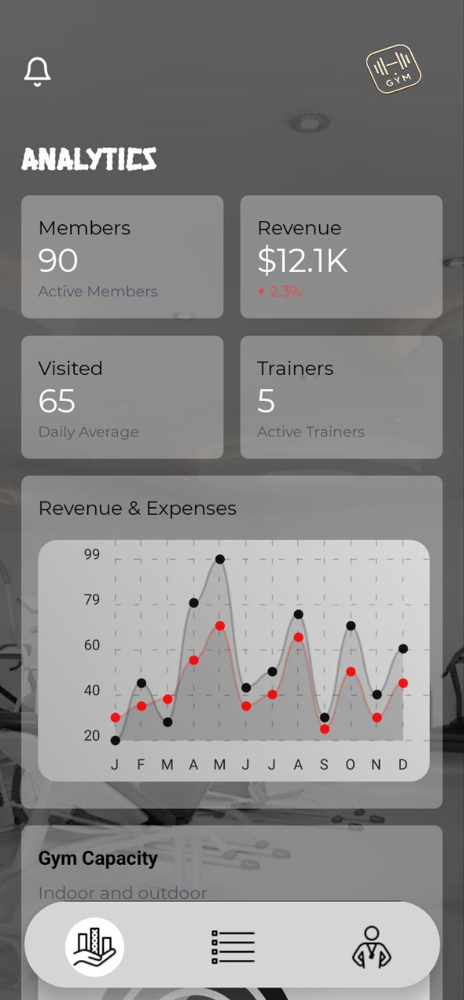

# Starter base

A starting point to help you set up your project quickly and use the common components provided by `react-native-reusables`. The idea is to make it easier for you to get started.

## Features

 ## gym_native_expo
